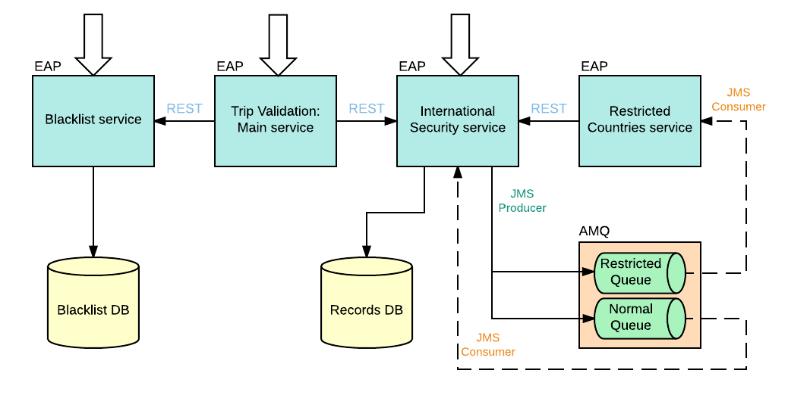

# MICROSERVICES: EAP, AMQ and Openshift

The aim of this set of projects is to demonstrate how microservices can be built using EAP 6.4 and AMQ 6.2 in Openshift.

There are 3 different REST services plus one AMQ server which maintains 2 different queues for asynchronous processing. Also, there is one service which does not expose any REST API and whose main purpose is to consume messages from one of the queues. All of these service are independently scalable, that means that the number of replicas per service may differ from each other (Ex: based on metrics, loads and so on). Next diagram shows the whole microservices architecture from a general perspective:



## Microservices description

1. **Trip validation service**: main service. It will use the others to compose a valid response. It exposes 2 different REST operations:
   - validate trip: it will validate input trip request by calling blacklist passport service and international security service
   - get pending cases status: for those requests that require asynchronous management, the user will have this operation to poll the status of its request by case id. This operation will call international security service, which in some cases will manage the request asynchronously.

2. **Passport blacklist service**. Simple read/create/remove REST operations:
   - read operation: it will try to get the given passport from the blacklist DB. This operation is used by the main validation service as part of the validate trip operation
   - create operation: it will add a new passport to the blacklist DB
   - remove operation: it will remove an existing passport entry from the blacklist DB

3. **International security service**: it will verify the incoming request based on the destination country. It will also expose read/update/remove operations to manage asynchronous validations. These are the 4 REST operations available:
   - validate trip based on destination country. Simple rules are used in order to process the request:
      1. if destination country is the same as the nationality in passport: only validate date of expiry and set OK or REJECT status in records DB.
      2. if destination country starts by 'a' or 'A' or ends by 'n' or 'N': it will set the status to PENDING and message to 'Validation pending: Restricted countries'. Then, a message will be send to a remote queue with name 'java:/jms/queue/RestrictedCountriesQueue' inside the AMQ messaging server.
      3. Other cases: it will set the status to PENDING and message to 'Validation pending: Normal procedure'. Then, a message will be send to a remote queue with name 'java:/jms/queue/NormalProcedureQueue' inside the AMQ messaging server.
   - read records based on recordId returned by validation operation
   - update records: it will modify those PENDING request to OK or REJECTED. This operation will be used by message consumers to notify status changes related to PENDING trip validations.
   - remove records: it will remove records from records DB. 

     This service also contains a MDB that will consume messages from the remote queue 'java:/jms/queue/NormalProcedureQueue', process them and finally, notify via REST the final status of the trip validation to the international security service.

4. **Restricted countries service**. It is a basic MDB that consumes messages from the remote queue 'java:/jms/queue/RestrictedCountriesQueue', process them and finally, notify via REST the final status of the trip validation to the international security service.


## Openshift template

I have also included a Openshift template which describes the microservices composition and facilitate the instatiation of the whole example.

It is mainly composed by:

- 4 EAP instances (basic ones)
- 2 MySql instances (using ephemeral databases for the demonstration, so stored data will be lost in case of pods recreation)
- 1 AMQ instance (In case you would like to create an AMQ mesh, you must execute `oc policy add-role-to-user view system:serviceaccount:<project-name>:default`)

Only 3 services are exposed to the outside world: 

- Trip validation service, for trip validation and pending cases polling.
- Blacklist service, so a given user could get/create/remove passports from the blacklist
- International securitity service, for all of the 4 operations explained before.

TODO: include a diagram of the microservices architecture using openshift nomenclature and establishing relationships with what it is defined in the template (Routes, Services, Pods and so on)

### Instantiate template

We are going to instantiate the microservices.yml template provided using `oc` CLI commands .

Once you are logged in, create a new project (if needed):

`oc new-project microservices-demo`

If you created the project, you are automatically moved to the project. In case you have to move to an existing project:

`oc project microservices-demo`

Then, process the template and instantiate it:

`oc process -f /path/to/template/file | oc create -f -`

The output expected should be similar to the following:

```
buildconfig "int-security-service" created
buildconfig "passport-blacklist-serv" created
buildconfig "trip-validation-service" created
buildconfig "rest-countries-service" created
imagestream "int-security-service" created
imagestream "passport-blacklist-serv" created
imagestream "trip-validation-service" created
imagestream "rest-countries-service" created
deploymentconfig "blacklistdb" created
deploymentconfig "int-security-service" created
deploymentconfig "passport-blacklist-serv" created
deploymentconfig "recordsdb" created
deploymentconfig "trip-validation-service" created
deploymentconfig "broker-amq" created
deploymentconfig "rest-countries-service" created
route "int-security-service" created
route "passport-blacklist-serv" created
route "trip-validation-service" created
service "blacklistdb" created
service "int-security-service" created
service "passport-blacklist-serv" created
service "recordsdb" created
service "trip-validation-service" created
service "broker-amq-tcp" created
service "rest-countries-service" created
```

Notice that we have not passed any parameter to the template, so it will be processed with all default values. In case you want to list of the parameters that you can override:

`oc process --parameters -f /path/to/template/file`

Output should be similar to:

```
NAME                                    DESCRIPTION                                                                                   GENERATOR           VALUE
MICROSERVICES_APP_NAME                  Microservices set name                                                                                            microservices
GIT_URI                                 Git URI for microservices source                                                                                  https://github.com/dsanchor/microservices-openshift.git
GIT_REF                                 Git reference for microservices source (either master or branch)                                                  master
TRIP_VALIDATION_APP_NAME                Trip validation microservice name. This microservice is the main one                                              trip-validation-service
TRIP_VALIDATION_GENERIC_SECRET          Trip validation microservice generic secret                                                   expression          [a-zA-Z0-9]{16}
TRIP_VALIDATION_GITHUB_SECRET           Trip validation microservice github secret                                                    expression          [a-zA-Z0-9]{16}
TRIP_VALIDATION_ROUTE_HOST              Trip validation microservice route host. Example: <app-name>-<project-name>.<domain>                              
INTERNATIONAL_SECURITY_APP_NAME         International security microservice name                                                                          int-security-service
INTERNATIONAL_SECURITY_GENERIC_SECRET   International security microservice generic secret                                            expression          [a-zA-Z0-9]{16}
INTERNATIONAL_SECURITY_GITHUB_SECRET    International security microservice github secret                                             expression          [a-zA-Z0-9]{16}
INTERNATIONAL_SECURITY_ROUTE_HOST       International security microservice route host. Example: <app-name>-<project-name>.<domain>                       
PASSPORT_BLACKLIST_APP_NAME             Passport blacklist microservice name                                                                              passport-blacklist-serv
PASSPORT_BLACKLIST_GENERIC_SECRET       Passport blacklist microservice generic secret                                                expression          [a-zA-Z0-9]{16}
PASSPORT_BLACKLIST_GITHUB_SECRET        Passport blacklist microservice github secret                                                 expression          [a-zA-Z0-9]{16}
PASSPORT_BLACKLIST_ROUTE_HOST           Passport blacklist microservice route host. Example: <app-name>-<project-name>.<domain>                           
BLACKLIST_DB_NAME                       Passport blacklist data base name                                                                                 blacklistdb
BLACKLIST_DATABASE_SERVICE_PORT         Passport blacklist data base service port                                                                         3306
BLACKLIST_DATABASE_USER                 Passport blacklist data base username                                                         expression          [a-zA-Z0-9]{8}
BLACKLIST_DATABASE_PASSWORD             Passport blacklist data base password                                                         expression          [a-zA-Z0-9]{8}
INT_SEC_DB_NAME                         International security data base name                                                                             recordsdb
INT_SEC_DATABASE_SERVICE_PORT           International security data base service port                                                                     3306
INT_SEC_DATABASE_USER                   International security data base username                                                     expression          [a-zA-Z0-9]{8}
INT_SEC_DATABASE_PASSWORD               International security data base password                                                     expression          [a-zA-Z0-9]{8}
BROKER_AMQ_NAME                         AMQ broker name.                                                                                                  broker-amq
AMQ_USER                                AMQ username                                                                                  expression          [a-zA-Z0-9]{8}
AMQ_PASSWORD                            AMQ password                                                                                  expression          [a-zA-Z0-9]{8}
BROKER_AMQ_MESH_SERVICE_NAME            AMQ broker mesh service name.                                                                                     broker-amq-tcp
RESTRICTED_COUNTRIES_APP_NAME           Restricted countries microservice name                                                                            rest-countries-service
RESTRICTED_COUNTRIES_GENERIC_SECRET     Restricted countries microservice generic secret                                              expression          [a-zA-Z0-9]{16}
RESTRICTED_COUNTRIES_GITHUB_SECRET      Restricted countries microservice github secret                                               expression          [a-zA-Z0-9]{16}
```

Check if all pods are running:

`oc get pods | grep Running`

You must get 7 pods running:

```
blacklistdb-1-y84n0               1/1       Running     0          7m
broker-amq-1-c1dtz                1/1       Running     0          7m
int-security-service-1-0qmnq      1/1       Running     0          2m
passport-blacklist-serv-1-c6dza   1/1       Running     0          57s
recordsdb-1-lvloc                 1/1       Running     0          7m
rest-countries-service-1-rzplp    1/1       Running     0          2m
trip-validation-service-1-dni5l   1/1       Running     0          1m
```

### Test microservices

First, get all the routes available in the project. 

`oc get routes`

We should get these 3 with your Openshift subdomains (different hosts from my example):

```
NAME                      HOST/PORT                                                        PATH      SERVICE                   LABELS              INSECURE POLICY   TLS TERMINATION
int-security-service      int-security-service-microservices-demo.apps.domain              int-security-service      app=microservices                     
passport-blacklist-serv   passport-blacklist-serv-microservices-demo.apps.domain           passport-blacklist-serv   app=microservices                     
trip-validation-service   trip-validation-service-microservices-demo.apps.domain           trip-validation-service   app=microservices                     

```

Let's start!

**1. Validate a new trip, where destination is exactly the same as the passport nationality**. The sequence is:
   - Request will be managed by the trip-validation-service
   - trip-validation-service will verify if the passport is in the blacklist by calling the passport-blacklist-service using REST
      - if not in blacklist, trip-validation-service will perform a REST request to international-security-service to check for any other issues
      - international-security-service will just verify the date of expiry of the passport since the destination is exactly the same as the passport nationality 
   - Other cases such passport in blacklist or invalid date of expiry will return a REJECT response to the client

Execute:

`curl -i -H "Accept: application/json" -H "Content-Type: application/json" -X POST -d @requests/validation1 http://trip-validation-service-microservices-demo.apps.domain/trips`

Notice that the body of the request is the content of the file 'validation1' located under 'requests' directory.

Expected response is HTTP 200 with content:

`{"validationCode":"OK","additionalInformation":"","caseId":4}`


**2. Add passport to the blacklist.**

Execute:

`curl -i -H "Accept: application/json" -H "Content-Type: application/json" -X PUT http://passport-blacklist-serv-microservices-demo.apps.domain/passports/blacklist/AAI89891`

Expected response is HTTP 204 with no content.


**3. Execute again step number 1 and validate that the passport is rejected since it is included in the blacklist.**

Execute:

`curl -i -H "Accept: application/json" -H "Content-Type: application/json" -X POST -d @requests/validation1 http://trip-validation-service-microservices-demo.apps.domain/trips`

Expected response is HTTP 200 with content:

`{"validationCode":"REJECTED","additionalInformation":"Passport is blacklisted","caseId":null}`


**4. Validate a new trip, where destination is one identified as restricted country if its name starts by 'a' or ends by 'n'.** The sequence is:
   - Request will be managed by the trip-validation-service
   - trip-validation-service will verify if the passport is in the blacklist by calling the passport-blacklist-service using REST
      - if not in blacklist, trip-validation-service will perform a REST request to international-security-service to check for any other issues
      - international-security-service will identify the destination as a restricted country and will send a message to a the remote queue 'RestrictedCountriesQueue' 
      - restricted-countries-service will consume this message from the remote queue and will randomly (for this demonstration) accept or reject the request.
      - restricted-countries-service will notify back via REST request the status of the validation to the international-security-service

Notice that I have included a random sleep in the restricted-countries-service MDB (consumer) in order to be able to poll those pending request and see how the status changes from PENDING to OK or REJECT.

Execute:

`curl -i -H "Accept: application/json" -H "Content-Type: application/json" -X POST -d @requests/validation2 http://trip-validation-service-microservices-demo.apps.domain/trips`

Expected response is HTTP 200 with content:

`{"validationCode":"PENDING","additionalInformation":"Validation pending:  Restricted countries","caseId":5}`


**5. Validate a trip where the destination is not restricted.** Sequence is similar to '4.' but with some differences:
   - The message is sent to a different remote queue with name NormalProcedureQueue. 
   - The consumer is defined in the international-security-service instead, which will validate the date of expiry based on the length of the name of the destination country (in months). Example: France (6 letters) will require 6 months.

Execute:

`curl -i -H "Accept: application/json" -H "Content-Type: application/json" -X POST -d @requests/validation3 http://trip-validation-service-microservices-demo.apps.domain/trips`

Expected response is HTTP 200 with content:

`{"validationCode":"PENDING","additionalInformation":"Validation pending:  Normal procedure","caseId":6}`


**6. Get pending cases using caseId of last test '5.':**

Execute:

`curl -i -H "Accept: application/json" -H "Content-Type: application/json" -X GET http://trip-validation-service-microservices-demo.apps.domain/trips/cases/6`

Expected response is HTTP 200 with content:

`{"validationCode":"OK","additionalInformation":"Passport accepted in destination country","caseId":6}`

I would suggest to repeat '4./5.' and '6.' to see how the status changes from PENDING to OK or REJECT.

Feel free to also discover by yourself other REST operations exposed in international-security-service and passport-blacklist-service.

